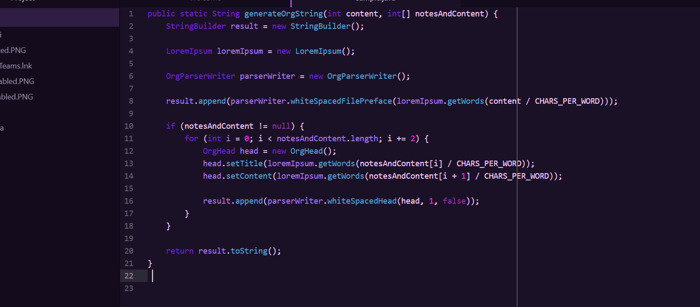
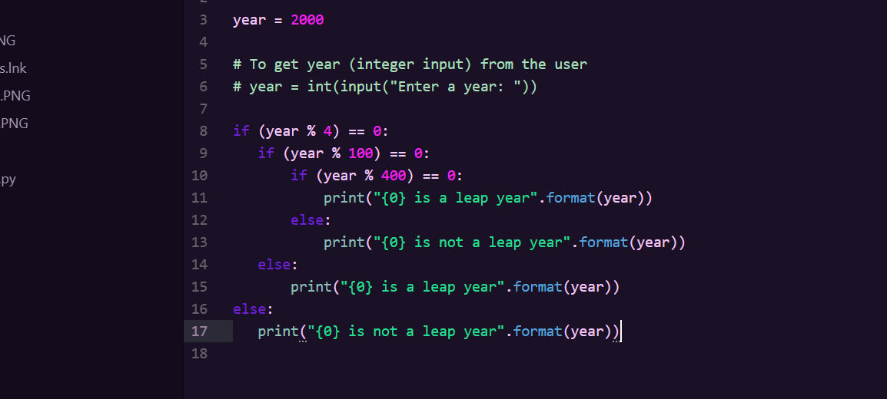
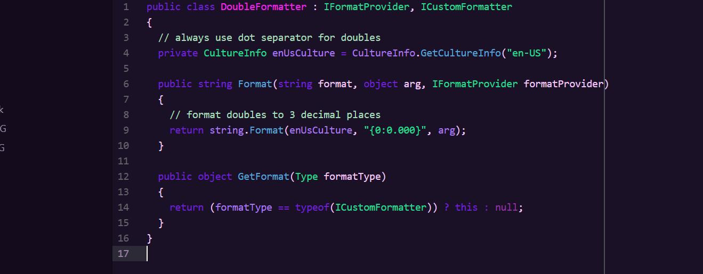

---

# PurpleCity Dark Syntax theme

Java:

Python:

C#:

## Install

This theme is installed by default with Atom and can be activated by going to the _Themes_ section in the Settings view (`cmd-,`) and selecting it from the _Syntax Themes_ drop-down menu.
